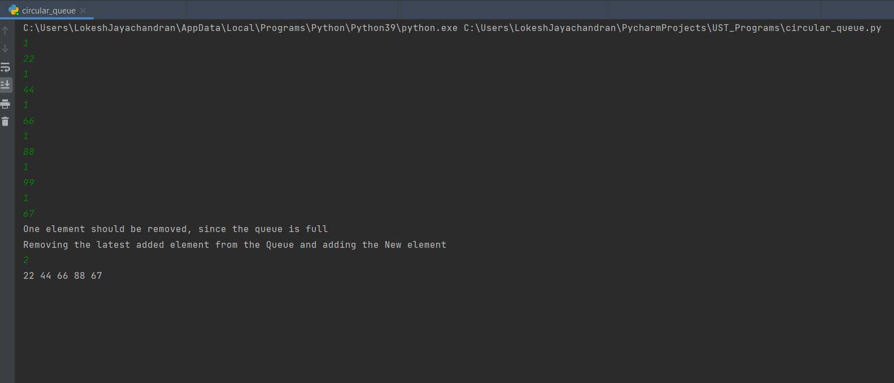
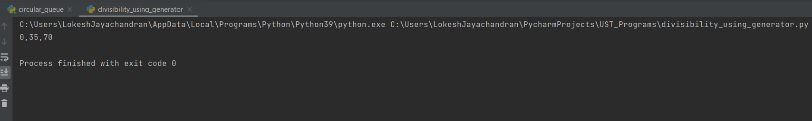

# Programs
### 1. Circular Queue Program

>>Circular Queue is a linear data structure 
its last position is connected to it first position to make a circular queue. 

Output for the Reference: 

### 2. Divisibility Program using Generators

>>Generators is creates its own iterator function, which will be represented by yield keyword , similar to return statement 

Output for the Reference

